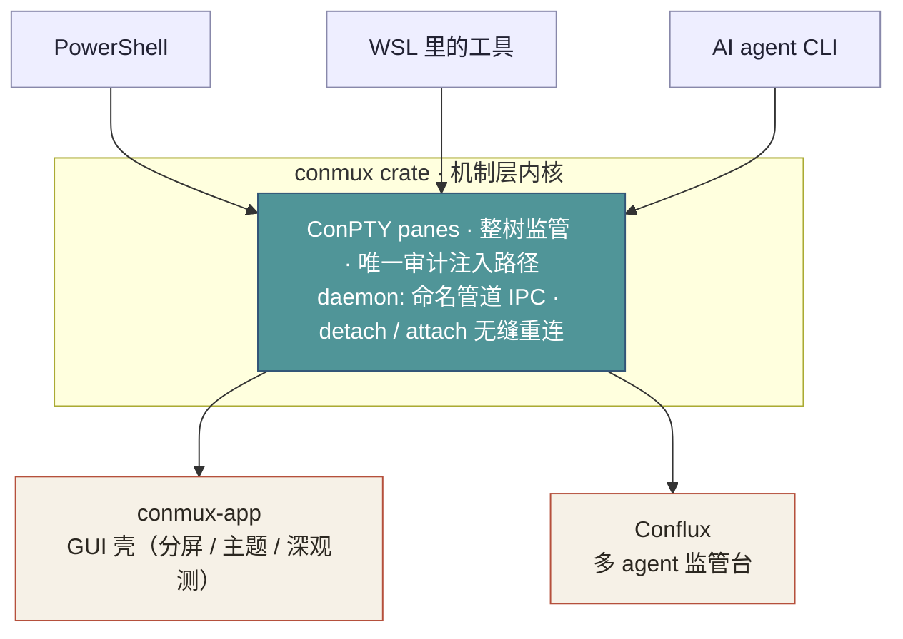

<p align="center">
  <picture>
    <source media="(prefers-color-scheme: dark)" srcset="./assets/logo-dark.svg">
    
  </picture>
</p>

<h1 align="center">conmux</h1>

<p align="center">
  <a href="https://crates.io/crates/conmux"></a>
  <a href="#license"></a>
  
  <a href="https://verson1daddy.github.io/Conmux/"></a>
</p>

<p align="center">
  <b>Bring any CLI onto Windows as a supervised, multiplexed session.</b><br>
  为 Windows 而生的类 tmux 中间件 —— PowerShell、WSL、AI agent，活在同一套受监管的会话里。
</p>

<p align="center">
  <a href="#english">English</a> · <a href="#中文">中文</a> · <a href="https://verson1daddy.github.io/Conmux/">📖 Manual / 用户手册</a>
</p>

---



<a id="english"></a>

## What is conmux?

conmux is an **independent product**, not an internal component. It's a Windows-native terminal multiplexer — the terminal foundation that [Conflux](https://github.com/Verson1daddy/Conflux) (a multi-agent CLI workbench) is built on, but it stands on its own: if you download conmux you get a terminal multiplexer, nothing else.

Reach for tmux to do this on Linux/Mac — except tmux never targets native Windows and lives inside WSL. conmux runs directly on **ConPTY**: every pane is a real Windows pseudo-console, supervised as a whole process tree, addressable from code.

It ships in two layers: the **`conmux` crate** (Rust, on [crates.io](https://crates.io/crates/conmux)) — the mechanism-layer kernel; and **conmux-app** (a Tauri GUI) — a desktop shell over it.

> 📖 **Full user manual (tiered guides):** <https://verson1daddy.github.io/Conmux/>

## Why conmux

Windows Terminal is a fine terminal *emulator* — and that's exactly its scope. Three things sit structurally outside it:

1. **Process-level session persistence** — close the window, your processes keep running; reattach later. (tmux upstream will never target native Windows.)
2. **A programmable control plane** — a multiplexer you drive from code: framed request/response, per-pane event streams, stable pane IDs, capture with ANSI on/off.
3. **Unified Win/WSL process supervision** — one session tree where a PowerShell pane and a WSL pane are equally supervised, killable, addressable. Every existing option owns only half. *(This unification is the roadmap goal — M4; today conmux launches a WSL tool as a supervised pane, deep cross-boundary unification is not shipped yet.)*

## What works today (library layer)

- **Real ConPTY panes** — spawn, resize, kill, respawn; DSR (`ESC[6n`) answered inline so TUI apps don't hang.
- **Whole-tree supervision** — every pane lives in a Job Object (`KILL_ON_JOB_CLOSE`): no orphaned grandchildren, ever.
- **Single audited write path** — all input through one injection channel with pluggable hooks (policy / audit / rate-limit), fail-closed.
- **Scrollback & capture** — line-indexed scrollback, capture with ANSI-stripping switch.
- **Event stream** — `PaneOutput` (sequenced) / `PaneExited` (exact exit codes) via a pluggable sink.
- **Daemon (detach / attach)** — one daemon holds every ConPTY; thin CLI/GUI clients over a named pipe. Detach (or kill) a client and the pane survives; reattach and the exact screen replays — scrollback **and** terminal-mode state — no dropped/duplicated bytes. Backed by 140+ tests including real-pipe + real-process integration tests.

> **Honest status:** early development (v0.1.x), Windows-only. The daemon has landed. The native GUI shell and cross-WSL unification are the active roadmap. APIs outside the frozen wire-protocol layer are unstable.

## Install

**Library / CLI** — on [crates.io](https://crates.io/crates/conmux):

```powershell
cargo install --locked conmux
```

**GUI app (conmux-app)** — grab the installer from [**Releases**](https://github.com/Verson1daddy/Conmux/releases). It's **unsigned** (student project, no signing budget): Windows SmartScreen will flag the publisher as unknown → click **More info → Run anyway**. The GUI's source lives in the [Conflux monorepo](https://github.com/Verson1daddy/Conflux).

## Security & trust boundary

conmux's trust boundary is the **current user**, enforced by the named pipe's DACL (only your SID), `PIPE_REJECT_REMOTE_CLIENTS`, and first-instance squatting protection. Honestly scoped: same-user is *not* an OS-enforced wall — the pipe-layer checks raise the bar and stay auditable, they don't defeat malicious code already running as you. **Local only: no accounts, no telemetry, nothing leaves the machine.** Note: `kill-server` (or a daemon crash) drops every Job Object and terminates every pane — the flip side of the zero-orphan guarantee, and deliberate.

## About & contributing

conmux is an open-source project built by a student at **South China Normal University (华南师范大学)** — an attempt to make the CLI-agent workflow on Windows genuinely pleasant, without dragging in a whole IDE.

Bug reports from real Windows workloads are especially valuable, and I'd love help making it dead-easy to bring *your* agent CLI onto Windows. Please **open an [issue](https://github.com/Verson1daddy/Conmux/issues) or discussion, or send a PR** (a heads-up before large changes lets us align on the mechanism-vs-semantics boundary).

📮 **Contact / 联系** — email **2287710676@qq.com**, or open an issue. Let's build a better Windows agent ecosystem together.

## License

Dual-licensed under either [MIT](LICENSE-MIT) or [Apache 2.0](LICENSE-APACHE), at your option.

---

<a id="中文"></a>

## conmux 是什么

conmux 是一个**独立产品**，不是内部组件。它是一个 Windows 原生的终端复用器——[Conflux](https://github.com/Verson1daddy/Conflux)（多 agent CLI 工作台）的终端地基，但它自己就能独立成立：下载 conmux，你得到的就是一个终端复用器，别无其他。

在 Linux/Mac 上这类事你会用 tmux——可 tmux 从不面向 Windows 原生、得钻进 WSL 里跑。conmux 直接跑在 **ConPTY** 上：每个 pane 都是真实的 Windows 伪控制台，作为整棵进程树被监管，还能从代码驱动。

两层交付：**`conmux` crate**（Rust，在 [crates.io](https://crates.io/crates/conmux)）——机制层内核；**conmux-app**（Tauri GUI）——其上的桌面壳。

> 📖 **完整用户手册（分级 guide）：** <https://verson1daddy.github.io/Conmux/>

## 为什么用 conmux

Windows Terminal 是个不错的终端*模拟器*——它的范围也就到这。有三件事结构性地在它之外：

1. **进程级会话持久**——关掉窗口，进程继续跑；回头再接回来。（tmux 上游永远不会做 Windows 原生。）
2. **可编程控制面**——一个能从代码驱动的复用器：带边框的请求/应答、per-pane 事件流、稳定 pane ID、可开关 ANSI 的捕获。
3. **统一的 Win/WSL 进程监管**——一棵会话树里，PowerShell pane 和 WSL pane 被同等监管、可杀、可寻址。现有方案都只占一半。*（这个"统一"是路线图目标 M4；今天 conmux 能把 WSL 里的工具当受监管 pane 起，深度跨边界统一尚未做。）*

## 现在能用的（库层）

- **真实 ConPTY pane**——spawn / resize / kill / respawn；DSR（`ESC[6n`）内联应答，全屏 TUI 不卡启动。
- **整树监管**——每个 pane 在一个 Job Object（`KILL_ON_JOB_CLOSE`）里：绝无孤儿孙进程。
- **唯一审计注入路径**——所有输入走一条注入信道 + 可插拔钩子（策略/审计/限速），fail-closed。
- **scrollback 与捕获**——行索引 scrollback，可开关 ANSI 的捕获。
- **事件流**——`PaneOutput`（带序号）/ `PaneExited`（精确退出码），经可插拔 sink。
- **daemon（detach/attach）**——一个 daemon 持有全部 ConPTY；瘦 CLI/GUI 客户端经命名管道接入。关掉（或杀掉）客户端，pane 照活；重新 attach，画面原样重放——scrollback **和**终端模式态都在，不丢帧不重帧。140+ 测试撑着，含真管道 + 真进程集成测试。

> **诚实状态**：早期开发（v0.1.x），仅 Windows。daemon 已落地。原生 GUI 壳与跨 WSL 统一是进行中的路线图。冻结的 wire 协议层之外的 API 都还不稳定。

## 安装

**库 / CLI** —— 在 [crates.io](https://crates.io/crates/conmux)：

```powershell
cargo install --locked conmux
```

**GUI 应用（conmux-app）** —— 从 [**Releases**](https://github.com/Verson1daddy/Conmux/releases) 下载安装包。它**未签名**（学生项目、无签名预算）：Windows SmartScreen 会提示"发布者未知" → 点 **更多信息 → 仍要运行**。GUI 源码在 [Conflux monorepo](https://github.com/Verson1daddy/Conflux)。

## 安全与信任边界

conmux 的信任边界是**当前用户**，由命名管道的 DACL（只授权你的 SID）、`PIPE_REJECT_REMOTE_CLIENTS`、首实例抢注守卫强制。诚实划界：同用户**不是** OS 级的墙——管道层校验是抬高门槛 + 保持可审计，不防已经以你身份运行的恶意代码。**纯本地：无账号、无遥测、什么都不出这台机器。** 注意：`kill-server`（或 daemon 崩溃）会 drop 全部 Job Object、终结每个 pane——这是"零孤儿"保证的另一面，有意为之。

## 关于与共建

conmux 是**华南师范大学**一名学生做的开源项目——想把 Windows 上的 CLI agent 工作流做得真正顺手，又不用背上一整个 IDE。

来自真实 Windows 工作负载的 bug 报告尤其宝贵，也很希望有人帮着把"让你的 agent CLI 轻松接入 Windows"做好。欢迎 **提 [issue](https://github.com/Verson1daddy/Conmux/issues) / 开 discussion / 发 PR**（大改动前先打个招呼，好对齐"机制 vs 语义"的边界）。

📮 **联系方式** —— 邮箱 **2287710676@qq.com**，或直接开 issue。一起把 Windows 上的 agent 生态做得更好。

## License

双许可，[MIT](LICENSE-MIT) 或 [Apache 2.0](LICENSE-APACHE)，任选其一。

---

## Star History · 星标历史

<a href="https://www.star-history.com/#Verson1daddy/Conmux&Verson1daddy/Conflux&Date">
  <picture>
    <source media="(prefers-color-scheme: dark)" srcset="https://api.star-history.com/svg?repos=Verson1daddy/Conmux,Verson1daddy/Conflux&type=Date&theme=dark">
    
  </picture>
</a>

> 如果这个项目对您真的有帮助的话！还请 star star，fork fork！感谢各位！🌾
>
> If it genuinely helps you — please star star, fork fork! Thank you all! ⭐
